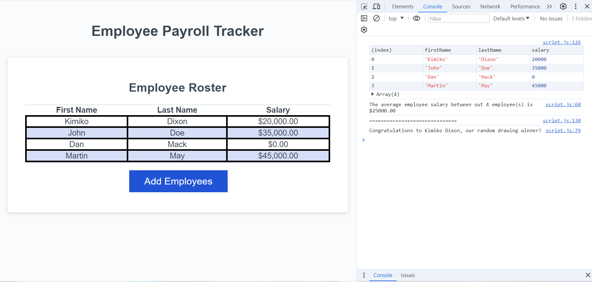

# Employee Payroll Tracker

## Description

This webpage allows an employer to log a list of their employee's names and salaries, calculate the average salary and select a random drawing winner.

## Usage

To use this webpage, click on the "Add Employees" button. You will be prompted for the first name, last name, and salary of an employee, then asked if you would like to add another employee. If you choose not to add another employee, they will be displayed on the webpage chart in alphabetical order. In the console the average salary and the drawing winner will be displayed.

[Deployed Application](https://kimiko-dixon.github.io/Employee_List/)

## Credits

N/A

## License

LICENSE in repo.